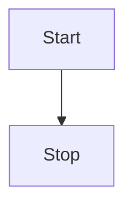

本篇作為筆記用途，記錄 [Mermaid](https://mermaid.js.org/) 參考資料

## Flowchart

官方文件：[https://mermaid.js.org/syntax/flowchart.html](https://mermaid.js.org/syntax/flowchart.html)

```mermaid
info
```


<!-- ## TEST

<script type="module">
    import mermaid from 'https://cdn.jsdelivr.net/npm/mermaid@11/dist/mermaid.esm.min.mjs';
    mermaid.initialize({
        startOnLoad:true,
        theme: 'neutral',
        flowchart:{
            useMaxWidth:false,
            htmlLabels:true
        }
    });
    await mermaid.run({querySelector:'code.language-mermaid'});
</script> -->

---

參考資料：

- [Sass/SCSS 簡明入門教學](http://blog.kdchang.cc/2016/10/11/sass-scss-tutorial-introduction/)
