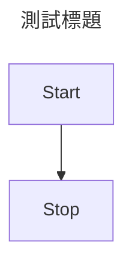
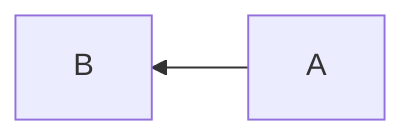
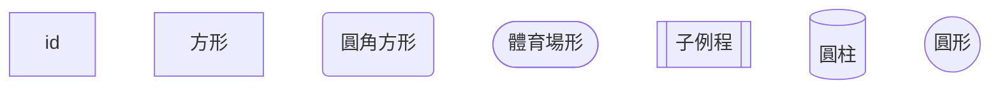
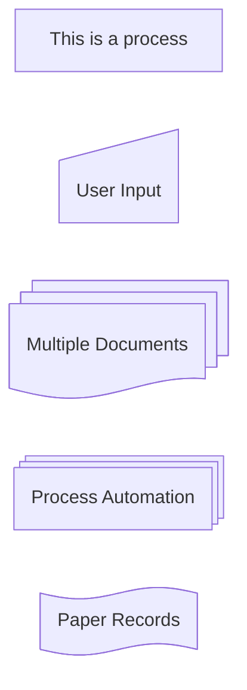
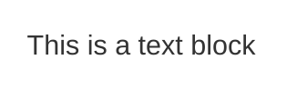
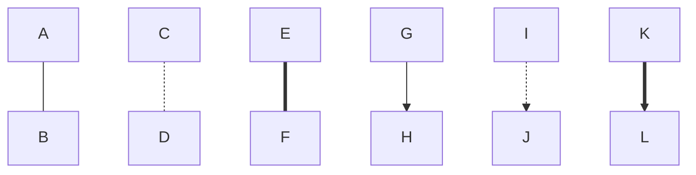
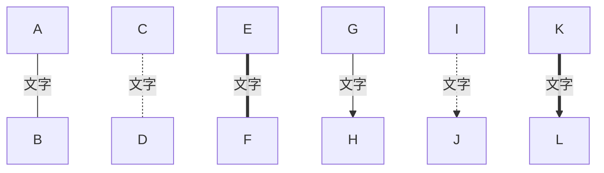

本篇作為筆記用途，記錄 [Mermaid](https://mermaid.js.org/) 參考資料

## 基本資訊

在 Markdown 中使用 Mermaid 的語法，並在程式碼區塊中加入 `info`，這樣就可以顯示 Mermaid 的版本資訊：

```
info
```
```mermaid
info
```

## 測試



## Flowchart

官方教學文件：[https://mermaid.js.org/syntax/flowchart.html](https://mermaid.js.org/syntax/flowchart.html)

### 基本語法

```
---
title: 第一個 flowchat
---
flowchart
```

### 流程圖方向

指定你的流程圖要往哪個方向走，預設是從上到下。

- `TB`：由上到下（預設）
- `BT`：由下到上
- `RL`：由右到左
- `LR`：由左到右



### 定義節點

上面的例子有兩個長方形 A 和 B，稱之為節點，可使用不同的標記產生出不同形狀的節點。

直接打上文字 (id) 就可以創造出節點，再用方括號等表示語法改變節點形狀和顯式的文字。也可以使用進階的標註方式來改變節點的形狀，例如下面第二個範例，詳細請參考官方文件[Expanded Node Shapes in Mermaid Flowcharts](https://mermaid.js.org/syntax/flowchart.html#expanded-node-shapes-in-mermaid-flowcharts-v11-3-0)。





透過進階語法，可以產生出沒有任何框線的節點，這樣就可以讓你在流程圖中使用不同的顏色來強調某些節點。



## 串聯節點

有了節點之後可以用直線、箭頭等符號將流程表示出來，這些符號可以用來表示不同的關係。



線上也可以加入敘述文字



## 其他技巧

兩個百分號代表註解，這不會被顯示出來

```
flowchart LR
    A --- B
    %% 註解
```

節點增加連結

```
flowchart LR
    A --- B
    click A "https://mermaid.js.org/"
```

套用主題：有 default, forest, neutral, dark, base 五種主題可選用

```
%%{init: {'theme': 'forest'} }%%
flowchart LR
  A --- B
```

自訂顏色

```
flowchart LR
  id1---id2
  style id1 fill:#d4bfb2, stroke:#877a71, stroke-width:2px, color:#ffffff
  style id2 fill:#e9b41b, stroke:#4f3d09, stroke-width:3px, stroke-dasharray:5 4
```

## 在沒有支援的網頁使用 Mermaid

如果是要在一般的網頁上面呈現 Mermaid，可以使用此技巧，將下面的程式碼放在 HTML 或是 Markdown 中，如此一來，當文件被呈現時，會自動載入 Mermaid 的 js 函示庫，這樣就可以在沒有支援的網頁上面呈現 Mermaid 了。

```
<script type="module">
    import mermaid from 'https://cdn.jsdelivr.net/npm/mermaid@11/dist/mermaid.esm.min.mjs';
    mermaid.initialize({
        startOnLoad:true,
        theme: 'neutral',
        flowchart:{
            useMaxWidth:false,
            htmlLabels:true
        }
    });
    await mermaid.run({querySelector:'code.language-mermaid'});
</script>
```

<script type="module">
    import mermaid from 'https://cdn.jsdelivr.net/npm/mermaid@11/dist/mermaid.esm.min.mjs';
    mermaid.initialize({
        startOnLoad:true,
        theme: 'neutral',
        flowchart:{
            useMaxWidth:false,
            htmlLabels:true
        }
    });
    await mermaid.run({querySelector:'code.language-mermaid'});
</script>

---

參考資料：

- [Mermaid Offical Website](https://mermaid.js.org/)
- [Creating diagrams on GitHub](https://docs.github.com/en/get-started/writing-on-github/working-with-advanced-formatting/creating-diagrams)
- [Mermaid 教學 | 打字就能做出的專屬圖表](https://hackmd.io/@showsun/mermaid)
