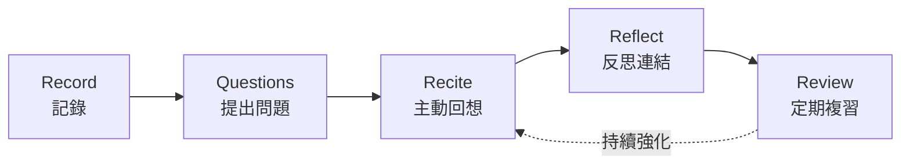
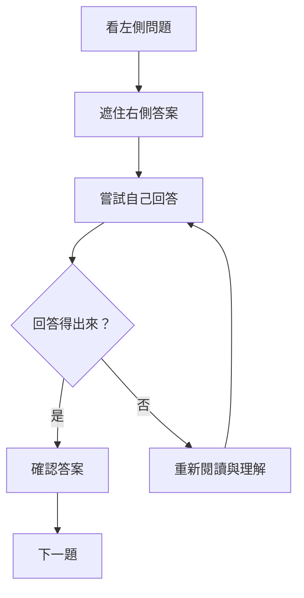
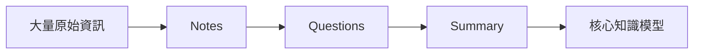
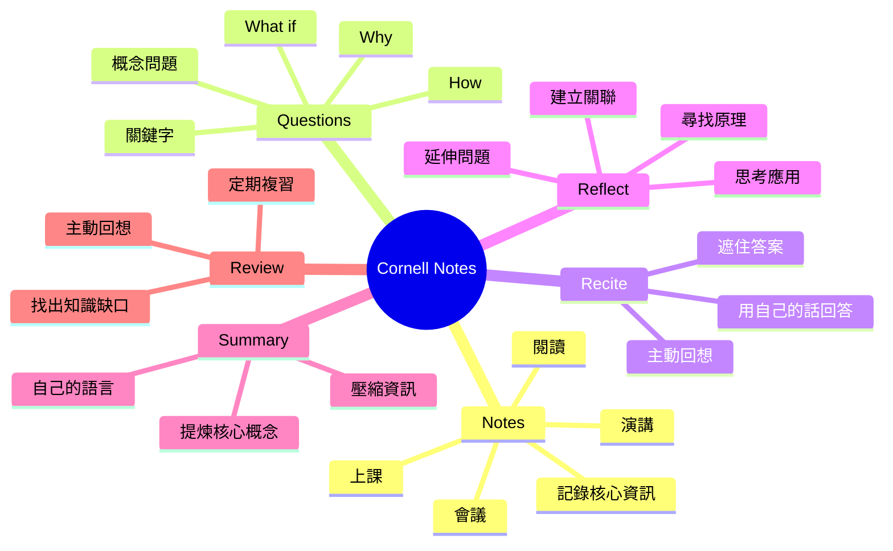
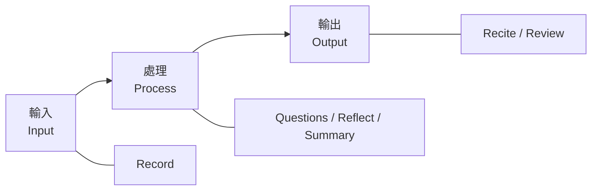
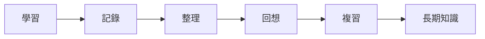
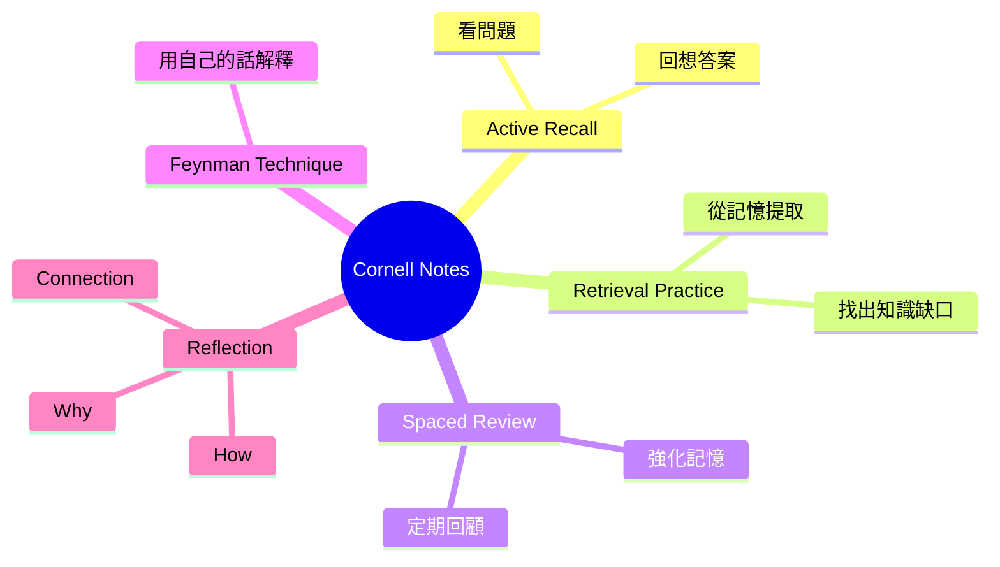
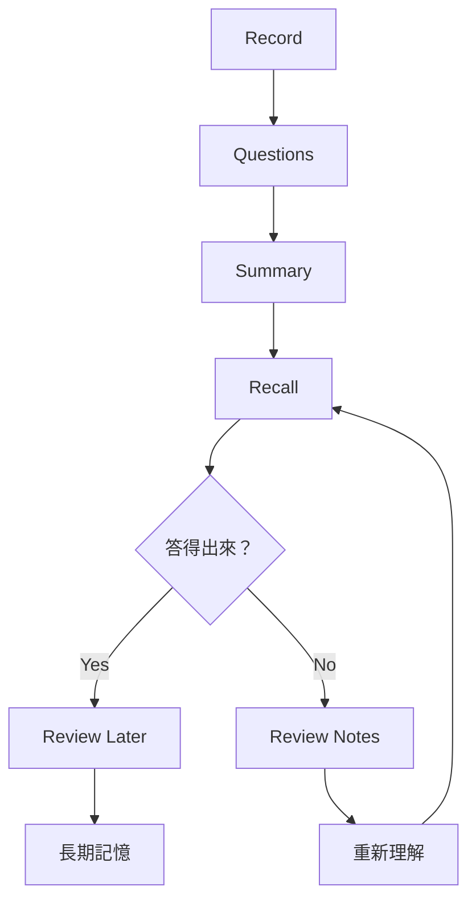

我們常常以為「有做筆記」就等於「有學會」，但實際上，很多人的筆記只是把老師講的、書上寫的內容重新抄一次。

當下看起來密密麻麻、資訊完整，真正要使用時卻發現：

- 找不到重點
- 不知道哪些內容重要
- 看過很多次，卻還是記不起來
- 筆記很多，但很少真正拿來複習
- 記錄的是別人的話，而不是自己的理解

**Cornell Note-Taking System（康奈爾筆記法）**想解決的正是這個問題。

它不是單純教你「怎麼排版筆記」，而是把：

> 記錄 → 提問 → 回想 → 思考 → 複習

整合成一套完整的學習流程。

換句話說，**Cornell Notes 的真正價值不在那三個格子，而在於它強迫你重新處理一次資訊。**

---

# 什麼是 Cornell Note-Taking System？

Cornell Note-Taking System，又稱 **Cornell Notes、Cornell Method**，是 Cornell University 教育學教授 **Walter Pauk** 所發展的筆記方法。

Cornell University 的資料指出，Pauk 在 1950 年代發展這套方法，後來並在 1962 年出版的《How to Study in College》中推廣。

它最大的特色，就是把一頁筆記切成三個區域：

1. **Cue / Question Column：提示／問題欄**
2. **Note-Taking Column：主要筆記欄**
3. **Summary：摘要欄**

基本結構如下：

```text
┌───────────────────────────────────────────────┐
│ Subject: __________________ Date: ___________ │
├──────────────┬────────────────────────────────┤
│ Cue Column   │        Note-Taking Area        │
│              │                                │
│ Keywords     │ Main Notes                     │
│ Questions    │ Key Concepts                   │
│ Cues         │ Definitions                    │
│              │ Examples                       │
│              │ Diagrams                       │
│              │                                │
├──────────────┴────────────────────────────────┤
│ Summary                                       │
│ Write a brief summary of the key points from  │
│ this page in your own words.                  │
└───────────────────────────────────────────────┘
```

Cornell 官方範本中，左側 Cue Column 約為 **2.5 吋**，右側 Note-taking Column 約 **6 吋**，底部則保留約 **2 吋**作為 Summary。

不過實際使用時完全不需要拿尺量。

只要掌握：

> **左小、右大、下面留摘要**

就可以了。

---

# Cornell Notes 最重要的不是格式，而是流程

很多人第一次看到 Cornell Notes，會把注意力放在：

> 「原來就是把紙分成三格。」

但如果只是把頁面分成三格，效果其實非常有限。

Cornell Notes 真正重要的是一套完整的學習循環。

Cornell Learning Strategies Center 現在將這套流程整理成五個步驟：

1. Record
2. Questions
3. Recite
4. Reflect
5. Review

可以把整個流程理解成：



真正發生學習的地方，其實是在後面四個步驟。

---

# Step 1：Record — 記錄

第一步是在上課、開會、看書或聽演講時，將重要資訊記錄在右側的 **Note-Taking Column**。

Cornell 官方建議使用簡短、電報式的句子，而不是逐字抄寫。

例如老師說：

> Dependency Injection 是一種設計技巧，由外部提供物件所需要的相依性，而不是讓物件自己建立相依物件，因此可以降低元件之間的耦合。

不需要整句抄下來，可以寫成：

```text
Dependency Injection

- 相依物件由外部提供
- 不由 class 自己建立
- 降低 coupling
- 提升 testability
```

重點不是「記完整」，而是：

> **只記足以幫助自己重建概念的資訊。**

因此可以大量使用：

- 關鍵字
- 短句
- 箭頭
- 符號
- 縮寫
- 圖示
- 流程圖
- 程式碼
- 關係圖

例如：

```text
DI
↓
外部注入 dependency
↓
降低 coupling
↓
容易替換 implementation
↓
方便 unit test
```

---

# Step 2：Questions — 把筆記變成問題

接下來才是 Cornell Notes 非常關鍵的一步。

**課程結束後，回頭閱讀右側筆記，然後在左側寫下問題。**

例如原始筆記：

| Question / Cue                | Notes                                      |
| ----------------------------- | ------------------------------------------ |
| Dependency Injection 是什麼？ | dependency 由外部提供                      |
| DI 解決什麼問題？             | 降低 coupling                              |
| 為什麼 DI 有利測試？          | 可以替換 implementation                    |
| .NET 如何實作 DI？            | IServiceCollection / constructor injection |

這個動作看似只是整理筆記，但實際上你已經從：

> 「記錄資訊」

進入：

> 「理解資訊」。

因為要寫出一個好問題，你必須先知道：

- 這段內容的核心概念是什麼？
- 這個概念回答了什麼問題？
- 哪些內容值得日後重新回想？

Cornell 官方也特別指出，建立問題可以幫助釐清意義、理解概念之間的關係，也能為之後的複習與考試準備建立基礎。

---

# Step 3：Recite — 遮住答案，自己回答

這可能是 Cornell Notes 最重要的一個步驟。

把右邊的 Notes 遮起來。

只看左邊的問題：

```text
Dependency Injection 是什麼？
```

然後不要偷看答案。

試著自己回答：

> Dependency Injection 是把物件需要的相依性從外部傳進來，而不是讓物件自己建立，因此可以降低彼此的耦合。

接著才打開右邊的筆記確認。

流程變成：



這和單純「一直看筆記」有非常大的差別。

一直看筆記屬於：

> Recognition：看到答案覺得熟悉。

而遮住答案重新回答，則是在進行：

> Retrieval：從記憶中主動把知識取回來。

Cornell Learning Strategies Center 也將 **Retrieval Practice（提取練習／主動回想）**列為重要的學習策略：透過主動從記憶中取回概念，可以發現哪些內容真正理解、哪些內容其實還不熟悉。

因此 Cornell Notes 最有價值的一件事就是：

> **你的筆記本身就會自動變成一份自我測驗題庫。**

---

# Step 4：Reflect — 思考，而不是只有記憶

接著開始問更深一層的問題。

Cornell 官方給出的方向包括：

- 這個事實的重要性是什麼？
- 背後基於什麼原理？
- 我要怎麼應用？
- 它和我已經知道的東西有什麼關係？
- 還可以延伸出什麼問題？

例如學習 Dependency Injection，可以再問：

```text
為什麼 DI 能降低 coupling？

如果不使用 DI 會怎樣？

DI 和 Dependency Inversion Principle 有什麼關係？

DI 是否一定需要 DI Container？

什麼情況反而不值得使用 DI？
```

這個階段已經從：

```text
What？
```

開始走向：

```text
Why？
How？
What if？
When？
```

這也是從「記憶知識」走向「建立知識模型」的重要一步。

---

# Step 5：Review — 定期複習

最後則是 Review。

Cornell 官方的原始建議是：

> 每週至少花約 10 分鐘重新檢視過去的筆記。

這裡有一個很重要的觀念：

**Review 並不是把筆記再讀一次。**

比較有效的方法仍然是：

```text
看問題
 ↓
回想答案
 ↓
確認答案
 ↓
標記不熟的內容
 ↓
重新理解
```

例如可以用：

```text
✓ 已掌握
△ 模糊
✗ 不理解
```

標記：

| Question                    | 狀態 |
| --------------------------- | ---: |
| DI 是什麼？                 |    ✓ |
| DI 與 DIP 有什麼差異？      |    △ |
| Service Lifetime 有哪些？   |    ✓ |
| Captive Dependency 是什麼？ |    ✗ |

下一次就優先處理：

```text
△ + ✗
```

而不是每一頁從頭讀到尾。

---

# 那麼 Summary 摘要欄是做什麼的？

Cornell Notes 底部還有一個非常重要的區域：

> **Summary**

課程或閱讀結束後，用自己的話寫下：

> 「如果這一頁只能留下三句話，我會留下什麼？」

例如：

```text
Dependency Injection 將物件的 dependency 從外部提供，
藉此降低元件之間的 coupling。

Constructor Injection 是 .NET 中最常見的實作方式。

DI Container 只是實作 DI 的工具，
Dependency Injection 本身是一種設計概念。
```

這個動作的目的不是重新抄一次筆記。

而是：

> **壓縮資訊。**

可以把資訊處理過程想成：



Summary 是在逼自己回答：

> 「所以這一頁到底在講什麼？」

Cornell Learning Strategies Center 也建議課後立即花幾分鐘回顧筆記並寫下簡短摘要，幫助處理剛學到的資訊。

---

# 5R 到底是哪五個 R？

中文介紹 Cornell Notes 時，經常會看到所謂的 **5R 筆記法**：

```text
Record
Reduce
Recite
Reflect
Review
```

也就是：

| 階段    | 意義       |
| ------- | ---------- |
| Record  | 記錄       |
| Reduce  | 簡化、整理 |
| Recite  | 回想／複述 |
| Reflect | 反思       |
| Review  | 複習       |

但 Cornell Learning Strategies Center 目前官方提供的版本則寫成：

```text
Record
Questions
Recite
Reflect
Review
```

兩種說法其實沒有本質衝突。

所謂 Reduce，核心就是把右側大量資訊：

> **整理成左側較精煉的關鍵字與問題。**

因此我反而建議把它理解成：

```text
Record
   ↓
Reduce → Questions
   ↓
Recite
   ↓
Reflect
   ↓
Review
```

其中「Questions」比「Reduce」更容易理解這個階段真正要做的事情。

---

# 一張圖理解 Cornell Notes

整套方法可以濃縮成下面這張圖：



如果再進一步抽象，其實只有三個階段：



而傳統抄筆記通常只有：

```text
Input → Record
```

Cornell Notes 則強迫我們完成：

```text
Input
 ↓
Record
 ↓
Organize
 ↓
Question
 ↓
Recall
 ↓
Reflect
 ↓
Summarize
 ↓
Review
```

這才是它真正有效的地方。

---

# 一個完整範例

假設今天正在學：

> HTTP Cache

可以寫成：

## Notes

| Questions / Cue                 | Notes                                     |
| ------------------------------- | ----------------------------------------- |
| Cache-Control 是什麼？          | HTTP response header，控制 cache behavior |
| `max-age` 是什麼？              | resource freshness lifetime               |
| `no-cache` 是否代表不能 cache？ | 否；可以 cache，但使用前必須重新驗證      |
| `no-store` 呢？                 | 不應儲存 response                         |
| ETag 的用途？                   | resource version identifier               |
| 304 是什麼？                    | Not Modified                              |

底部 Summary：

> HTTP Cache 的核心是避免重複傳輸沒有改變的資源。Cache-Control 決定快取策略，而 ETag 搭配條件式 Request 可以讓 Client 驗證資源是否改變；若沒有改變，Server 可以回傳 304。

幾天後複習時，只看：

```text
Cache-Control 是什麼？

no-cache 和 no-store 有什麼不同？

ETag 解決什麼問題？

HTTP 304 代表什麼？
```

如果能回答出來，代表這些知識已經逐漸變成自己的東西。

---

# Cornell Notes 適合哪些情境？

Cornell Notes 並不限於學生。

只要需要「吸收資訊 → 理解 → 重新使用」，其實都很適合。

## 1. 技術書

例如閱讀：

```text
Design Patterns
Clean Architecture
Domain-Driven Design
Functional Programming
```

右邊記錄概念，左邊轉成問題。

例如：

```text
為什麼 Dependency Rule 只能向內？

Entity 和 Use Case 差在哪裡？

Interface Adapter 解決什麼問題？
```

---

## 2. 技術演講與 Conference

不要逐字抄投影片。

記錄：

```text
核心觀念
Demo
重要 API
架構決策
限制
值得研究的關鍵字
```

演講結束後再把內容轉成：

```text
這場演講真正想解決什麼問題？

這個方案相較既有方案有什麼差異？

哪些東西值得我回去實作？
```

---

## 3. 線上課程

例如看一個 40 分鐘的 YouTube 技術教學：

```text
Video
 ↓
右側 Notes
 ↓
左側 Questions
 ↓
關閉影片
 ↓
自己回答
```

比看完影片後覺得：

> 「我好像懂了。」

有效得多。

---

## 4. 會議紀錄

甚至可以把 Cornell Notes 改成會議版本：

| Cue       | Notes            |
| --------- | ---------------- |
| Decision  | 最後做了什麼決定 |
| Why       | 為什麼           |
| Risk      | 有什麼風險       |
| Action    | 下一步           |
| Owner     | 誰負責           |
| Follow-up | 什麼時候確認     |

底部 Summary：

```text
這場會議最後決定了什麼？
```

如此一來，筆記就不再只是 Meeting Minutes，而是 Decision Record。

---

# Cornell Notes 最常見的錯誤

## 錯誤一：筆記寫得太完整

很多人追求：

> 「老師講的每句話都要記下來。」

最後就變成聽寫。

Cornell Notes 應該記：

```text
Concept
Relationship
Evidence
Example
Exception
Question
```

而不是全文。

---

## 錯誤二：左邊只寫關鍵字

例如：

```text
DI
IoC
DIP
Container
```

雖然可以用，但複習效果有限。

更好的方法是改成問題：

```text
DI 是什麼？

IoC 和 DI 有什麼關係？

DIP 和 DI 有什麼差異？

為什麼不應該把 DI 和 DI Container 畫上等號？
```

因為「問題」天然就能拿來做 Retrieval Practice。

---

## 錯誤三：Summary 只是再抄一次

Summary 不應該是：

```text
把上面的內容縮短重新寫一次。
```

而應該回答：

> 「如果要向另一個人解釋這一頁，我會怎麼說？」

---

## 錯誤四：從來沒有 Recite

這是最常見、也最可惜的情況。

如果只是：

```text
Record
→ Questions
→ Summary
```

你的 Cornell Notes 可能只是「整理得很好看的筆記」。

真正的學習循環是：

```text
Question
 ↓
閉卷回答
 ↓
確認
 ↓
再次回答
```

---

## 錯誤五：沒有 Review

筆記不是寫完就結束。

真正完整的生命週期應該是：



---

# Cornell Notes 的核心其實是「主動學習」

Cornell Notes 很容易被誤解成：

> 一種筆記排版方式。

但如果只看版面，就錯過它最重要的精神。

它真正建立的是一個循環：

```text
資訊
 ↓
記錄
 ↓
整理
 ↓
提問
 ↓
回想
 ↓
反思
 ↓
摘要
 ↓
再次回想
```

這也解釋為什麼它和許多現代學習方法可以自然結合。

例如：



也就是說：

> **Cornell Notes 可以當成承載其他學習策略的框架。**

---

# 紙本、OneNote、Notion 都可以

Cornell Notes 並不一定要使用紙筆。

例如在 Markdown 中，我甚至可以使用：

```markdown
# Dependency Injection

## Questions

- Dependency Injection 是什麼？
- DI 解決什麼問題？
- DI 和 DIP 有什麼關係？

## Notes

- dependency 由外部提供
- 降低 coupling
- constructor injection
- DI Container 負責建立 object graph

## Summary

DI 將 dependency 建立責任移到物件外部，
藉此降低元件之間的 coupling。
```

甚至可以搭配 HTML：

```html
<details>
    <summary>Dependency Injection 是什麼？</summary>

    將物件所需要的 dependency 從外部提供， 而不是讓物件自行建立 dependency。
</details>
```

如此就能把 Cornell Notes 直接做成：

> **可展開答案的數位 Flashcard。**

工具不是重點。

真正重要的是：

```text
Questions → Recall → Verify
```

這個循環有沒有發生。

---

# 我的 Cornell Notes 建議流程

如果想真正開始使用 Cornell Notes，我會把原本的方法稍微簡化成下面這個實用版本。

## 第一次學習

```text
① Record
只記核心資訊
```

↓

```text
② Question
把核心概念改寫成問題
```

↓

```text
③ Summary
用 3～5 句話重新解釋內容
```

---

## 第一次複習

```text
④ Recall
遮住 Notes，只看 Questions
```

↓

```text
⑤ Verify
確認自己回答是否正確
```

↓

```text
⑥ Reflect
思考 Why / How / Connection
```

---

## 後續複習

不要重新讀全文。

直接從：

```text
Questions
```

開始。

也就是：



如此才是真正把 Cornell Notes 從「筆記技巧」轉變成「學習系統」。

---

# 最後：不要追求漂亮的筆記，而要追求可以使用的筆記

Cornell University Learning Strategies Center 對筆記有一個很值得記住的觀念：

> 好筆記的重點，是它能不能真正被你使用。

因此 Cornell Notes 最重要的並不是：

```text
線畫得很漂亮
字寫得很整齊
顏色分類很多
版面很精緻
```

而是這份筆記能不能讓你完成：

```text
看到問題
 ↓
不用看答案
 ↓
自己解釋
 ↓
發現不知道的地方
 ↓
重新理解
```

如果可以，那這份筆記就在發揮作用。

所以如果要用一句話概括 Cornell Note-Taking System，我會這樣形容：

> **Cornell Notes 不是教你如何把資訊寫進筆記本，而是教你如何把資訊從筆記本重新取回大腦。**

這才是這套看似簡單的筆記法，真正值得學習的地方。

---

## 參考資料

- [Cornell University Learning Strategies Center, The Cornell Note-Taking System](https://lsc.cornell.edu/how-to-study/taking-notes/cornell-note-taking-system/)
- [Cornell University, Take Note: Popular Study Method has 'Cornell' Written All Over It](https://alumni.cornell.edu/cornellians/cornell-notes/)
- [Cornell University Learning Strategies Center, Effective Study Strategies](https://lsc.cornell.edu/how-to-study/effective-study-strategies/)。
- [Cornell-Note Taking-System（康奈爾筆記法全世界公認最高效的筆記法）](https://www.zhihu.com/tardis/zm/art/388397021)
